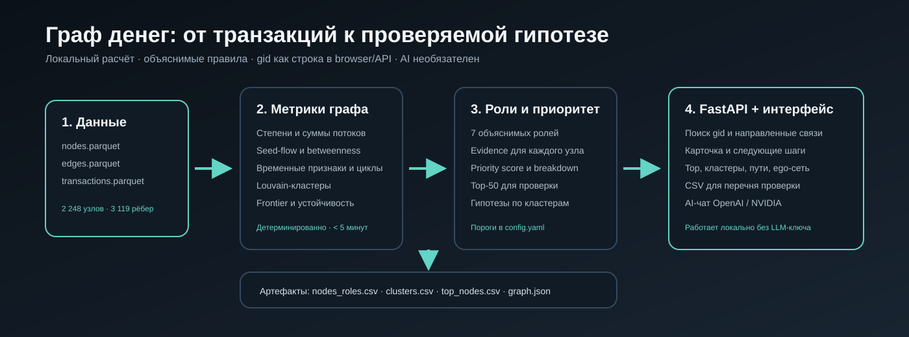

# TRACE — Граф денег

**Объяснимая аналитика транзакционной сети для AML-аналитика.** TRACE восстанавливает наблюдаемую структуру денежных потоков, определяет роли участников, выделяет сообщества и формирует список клиентов для первоочередной проверки с числовым обоснованием.

Основной вопрос продукта: **«Кого из 2 248 клиентов смотреть первым и почему?»** Аналитик получает направленный граф, Top-50, карточки узлов и следующие шаги проверки из одной локальной обработки трёх Parquet-файлов. Каждая роль и позиция в рейтинге связана с рассчитанными признаками. Выводы формулируются как гипотезы для проверки.



## Возможности

| Задача аналитика | Возможность TRACE | Где проверить |
|---|---|---|
| Восстановить движение средств | Направленный взвешенный граф, суммы и количество переводов, входящие и исходящие связи | «Граф», карточка узла |
| Понять роль клиента | Шесть ролей кейса и дополнительная роль `frontier`, числовое `evidence`, оценка уверенности | `out/nodes_roles.csv`, карточка |
| Выбрать приоритет проверки | Top-50 с объяснением и вкладами факторов в итоговый балл | «Топ», `out/top_nodes.csv` |
| Выделить структуру сети | Кластеры, состав ролей, seed-участники, внутренний оборот и гипотеза | «Кластеры», `out/clusters.csv` |
| Разобрать связи конкретного клиента | Поиск по полному `gid`, префиксу и последним цифрам, переход к соседям | Поиск и карточка |
| Найти дополнительные сигналы | Быстрые сопоставимые переводы, синхронные поступления, суммы у порога, короткие циклы | Признаки, флаги, API |
| Оценить структурную значимость | Сравнение удаления узлов по приоритету, степени и случайному выбору | «Устойчивость» |
| Подготовить дальнейшую проверку | Детерминированная карточка с фактами и следующими действиями, перечень на проверку с CSV-экспортом | Карточка, «Перечень на проверку» |
| Задать вопрос по сети | AI-ассистент с вызовом инструментов графа и ссылками на существующие `gid` | «Ассистент», при настройке провайдера |

## Быстрый запуск

Все команды выполняются из корня репозитория. Исходные `data/nodes.parquet`, `data/edges.parquet` и `data/transactions.parquet` включены в репозиторий.

```bash
git clone https://github.com/BAITC-Hacks/hack-5844ba02-dna.git
cd hack-5844ba02-dna
```

### Подключение LLM через .env

**Для работы AI-ассистента загрузите подготовленный файл `.env` в корень проекта рядом с `docker-compose.yml` или создайте его из `.env.example` и заполните ключ провайдера.** Файл должен называться именно `.env`, без расширения `.txt`. Если файл уже предоставлен командой, сохраните его значения и не заменяйте шаблоном.

Создание файла из шаблона (только если собственного `.env` ещё нет):

```bash
# Linux / macOS
cp .env.example .env
```

```powershell
# Windows PowerShell
Copy-Item .env.example .env
```

Пример содержимого для NVIDIA:

```dotenv
LLM_PROVIDER=nvidia
NVIDIA_API_KEY=<действующий ключ NVIDIA>
NVIDIA_MODEL=meta/llama-3.3-70b-instruct
OUT_DIR=out
DATA_DIR=data
```

Для OpenAI укажите `LLM_PROVIDER=openai`, `OPENAI_API_KEY=<действующий ключ OpenAI>` и `OPENAI_MODEL=gpt-4o-mini`. Достаточно настроить одного провайдера. Ключи хранятся только в локальном `.env`, который исключён из Git; файл с ключами не нужно отправлять в репозиторий.

**Docker Compose:** после размещения `.env` выполните `docker compose up --build --wait`. Compose прочитает настройки LLM и передаст их серверу. После изменения ключей повторите эту команду для применения конфигурации.

**Прямой запуск Python / Make:** загрузите переменные из `.env` командами раздела [«Загрузка .env при локальном запуске»](#загрузка-env-при-локальном-запуске), затем запустите сервер. Само наличие файла не загружает его в Python-процесс.

После запуска откройте `/api/health`: `llm_available: true` означает, что ключ выбранного провайдера настроен. Затем откройте «Ассистент» и задайте вопрос — успешный ответ проверяет доступность ключа и модели у провайдера. В карточке узла также доступна кнопка «Сформировать справку ИИ».

### Docker Compose

Требуются установленный и запущенный Docker с Compose v2, свободный порт `8000` и доступ к сети для первоначальной сборки образа.

```bash
docker compose up --build --force-recreate --wait
```

Compose устанавливает зависимости в образе Python 3.11, выполняет полный расчёт, записывает результаты в `out/` и запускает API. Каталог `data/` подключён только для чтения. Команда ожидает успешной проверки здоровья сервиса.

**Открыть приложение: [http://localhost:8000/](http://localhost:8000/).** Docker копирует актуальный `web/` при `--build`; после изменений фронтенда повторяйте эту команду.

Проверить [состояние сервиса](http://localhost:8000/api/health): ожидаются `"status":"ok"` и `"out_loaded":true`. Основной сценарий работает без `.env`, API-ключей, личных аккаунтов и платных подписок.

```bash
docker compose logs --tail=100 money-graph
docker compose down
```

Первая команда показывает журнал расчёта и сервера, вторая останавливает приложение. Выходные файлы остаются в локальной папке `out/`.

### Linux или macOS

Требуются Python 3.11+ с `venv` и `pip`, GNU Make и современный браузер. Версии прямых Python-зависимостей зафиксированы в [requirements.txt](requirements.txt).

```bash
make install && make all
```

`make install` создаёт `.venv` и устанавливает зависимости; `make all` последовательно рассчитывает данные и запускает сервер. Для выбора интерпретатора можно выполнить `make install PYTHON=python3.13`.

Только пересчёт, без сервера:

```bash
make pipeline
```

Повторный запуск приложения с готовыми результатами:

```bash
make serve
```

### Windows PowerShell

Требуется Python 3.13 с `pip` и `venv`. Активация виртуального окружения не нужна: команды используют его интерпретатор напрямую.

```powershell
python -m venv .venv
.\.venv\Scripts\python.exe -m pip install -r requirements.txt
$env:PYTHONUTF8 = "1"
.\.venv\Scripts\python.exe -m pipeline --data data --out out
.\.venv\Scripts\python.exe -m uvicorn api.main:app --host 127.0.0.1 --port 8000
```

После запуска открыть [http://localhost:8000/](http://localhost:8000/). Сервер работает до `Ctrl+C`. Команда `python -m pipeline --data data --out out`, выполненная интерпретатором окружения, воспроизводит все аналитические артефакты без ручного редактирования данных.

Для расчёта используется CPU; GPU, облачный кластер, Node.js и сборка frontend не требуются. Основной интерфейс, библиотеки визуализации и шрифты поставляются локально. Интернет нужен для установки зависимостей и, при подключении, внешнего LLM-провайдера.

## Проверка решения за пять минут

1. **Запустить расчёт и приложение** одним из способов выше. Проверить `out_loaded: true` в `/api/health`. Открыть `/api/summary`: исходный граф содержит 2 248 узлов, 3 119 рёбер и 81 seed.
2. **Открыть «Топ».** Проверить ранжированный список и объяснение приоритета. Первые 20 записей доступны также по адресу `/api/top?limit=20`.
3. **Найти `100000003115284100`.** Изучить роль, число плательщиков, наблюдаемые суммы, связи с seed и составляющие приоритета. Перейти из карточки к контрагенту.
4. **Сопоставить с `100000004156082100` и `100000005767403100`.** Первый пример показывает признаки координации, второй — интерпретацию обрыва наблюдения на четвёртом колене.
5. **Открыть «Кластеры» и «Устойчивость».** Проверить гипотезу о сообществе и сравнить стратегии удаления 20 узлов. В карточке сформировать следующий шаг проверки и добавить клиента в перечень на проверку.
6. **Проверить выгрузки.** В `nodes_roles.csv` должны быть все 2 248 уникальных `gid`, в `top_nodes.csv` — 50 ранжированных записей, а в `clusters.csv` — описание каждой группы, включая группу изолированных клиентов.

На графе стартовый рабочий срез содержит 180 приоритетных вершин. Для просмотра произвольного `gid` на схеме установите «Активных вершин» в **2248**, минимальные сумму и приоритет в **0** и включите все роли, затем используйте поиск. Стрелки показывают направление перевода; цвет узла — роль, золотая обводка — seed. Для полного идентификатора используйте карточку.

### Работа в интерфейсе

- Разделы «Граф», «Топ», «Кластеры», «Устойчивость» и «Ассистент» объединены общей навигацией; выбранные узел и кластер отражаются в адресе страницы.
- Карточка показывает оценки в процентах, числовое обоснование, вклад факторов, плательщиков, получателей и следующие шаги проверки.
- Из сообщества можно перейти к его узлам; в рейтинге есть фильтр по `gid` и роли и выгрузка CSV.
- Перечень на проверку позволяет добавлять и удалять клиентов и экспортировать `trace-review.csv`.
- Раздел устойчивости показывает кривые размера крупнейшей компоненты и достижимости от seed для доступных стратегий.
- Чат сохраняет контекст текущего диалога, показывает вызванные инструменты и ссылки на узлы. Доступность LLM определяется настройками сервера.

### Автоматические проверки

Сначала выполните пайплайн, чтобы API-тесты использовали результаты исходного датасета.

Linux/macOS:

```bash
make pipeline
make test
```

Windows PowerShell:

```powershell
$env:PYTHONUTF8 = "1"
.\.venv\Scripts\python.exe -m pipeline --data data --out out
.\.venv\Scripts\python.exe -m pytest -q
```

Проверки выполняются в базовом режиме без настроенных `LLM_PROVIDER`, `OPENAI_API_KEY` и `NVIDIA_API_KEY`. Тесты проверяют полноту выгрузок, диапазоны оценок, числовые объяснения, правила границы обхода, согласованность сумм транзакций и рёбер, API, сохранность идентификаторов и идентичность трёх CSV при повторном расчёте. Контракт пайплайна также проверяет время расчёта менее 300 секунд.

Для Linux/macOS предусмотрена проверка свежего клона с созданием окружения, расчётом и HTTP-запросами:

```bash
bash scripts/clean_check.sh
```

## Результаты контрольного расчёта

Контрольный прогон выполнен 23 сентября 2026 года на исходном датасете: Windows, Python 3.13.5, Intel Core i5-7200U 2.50 GHz, 8 ГБ RAM, зависимости из `requirements.txt`. Все перечисленные ниже значения получены из созданных артефактов.

| Показатель | Результат |
|---|---:|
| Полный расчёт по таймеру пайплайна, включая раскладку и экспорт | 111.9 секунды |
| Узлы с ролью, уверенностью, кластером и объяснением | 2 248 из 2 248 |
| Приоритетный список | 50 узлов |
| Сообщества Louvain | 44 и отдельная группа 19 изолированных клиентов |
| ROC AUC модели границы, out-of-fold | 0.684 на 1 723 обучающих узлах |
| Узлы четвёртого колена | 336 вероятных `terminal`, 108 `frontier` |
| Средний ARI для пяти сравнений кластеризации | 0.660 |
| Пересечение Top-20 при порогах −20% / +20% | 70% / 85% |

Время относится к обработке данных после импорта модулей; установка зависимостей и запуск сервера измерением не охватываются. Пайплайн записывает собственное время и длительность каждого этапа в `out/summary.json` при каждом запуске.

Распределение ролей: **38** `consolidator`, **22** `coordinator`, **15** `distributor`, **62** `transit`, **1 409** `terminal`, **108** `frontier`, **594** `peripheral`.

На результатах прогона успешно выполнены четыре проверки контракта выгрузок из `tests/test_pipeline.py`, 12 API-тестов и два теста контроля данных и временного сопоставления. HTTP-проверка подтвердила доступность `/web/index.html`, его основных ресурсов, `/api/health`, `/api/summary`, рейтинга и карточки узла.

После обновления интерфейса и API дополнительно выполнены все **13 API-тестов** итоговой версии, включая проверку главной страницы и её ресурсов. Аналитические модули и исходные данные соответствуют контрольному расчёту выше.

### Три примера для аналитического разбора

| Узел | Результат | Числовое обоснование | Следующий шаг аналитика |
|---|---|---|---|
| `100000003115284100` | `consolidator`, приоритет **1.000** | 8 плательщиков, 2 получателя; вход 2 160 500 KZT, выход 517 000 KZT; направленные пути от 4 seed в пределах двух колен; модельная оценка seed-потока около 850 тыс. KZT | Проверить происхождение крупных поступлений и контекст наблюдаемого удержания |
| `100000004156082100` | `coordinator`, приоритет **0.962** | 5 плательщиков и 26 получателей, сработал S2; вход 377 366.11 KZT, выход 2 319 556 KZT | Изучить веер распределения и запросить данные об источниках средств и остатках |
| `100000005767403100` | `frontier`, приоритет **0.421** | Четвёртое колено, 1 плательщик, вход 1 100 000 KZT; `p_terminal = 0.563 < 0.65` | Запросить исходящие переводы за границей четырёхколенного обхода |

Примеры получены расчётом; их `gid` служат навигацией для демонстрации и не задают правила классификации. Для произвольного узла применяется та же цепочка: **наблюдаемые факты → правило → роль → вклад в приоритет → действие аналитика**.

## Данные и контроль качества

| Параметр | Значение |
|---|---|
| Период | 1–31 июля 2026 года |
| Клиенты | 2 248, включая 81 seed |
| Направленные пары переводов | 3 119 |
| Отдельные транзакции | 4 840 |
| Глубина обхода | Четыре колена по исходящим переводам |
| Порог включения | 5 000 KZT |
| Источник | Обезличенный датасет организаторов HackAlem AI |

| Файл | Одна строка | Поля |
|---|---|---|
| `data/nodes.parquet` | Клиент | `gid`, `depth`, `is_seed` |
| `data/edges.parquet` | Пара плательщик → получатель за период | `src`, `dst`, `sum_kzt`, `n_tx`, `depth` |
| `data/transactions.parquet` | Отдельный перевод | `src`, `dst`, `date`, `sum_kzt` |

При загрузке проверяются обязательные поля, уникальность узлов и пар, конечность и неотрицательность сумм, наличие участников переводов в таблице узлов. Агрегация транзакций сверяется с рёбрами и по сумме, и по количеству операций. В граф включаются все узлы из `nodes.parquet`, в том числе 19 изолированных seed.

## Архитектура и технологии

```text
nodes.parquet + edges.parquet + transactions.parquet
                         |
              Контроль качества данных
                         |
         Направленный взвешенный граф NetworkX
                         |
       Структурные, потоковые и временные признаки
                         |
        Модель границы наблюдения + правила ролей
                         |
      Louvain + сигналы координации + приоритет
                         |
       Проверка стабильности + устойчивость сети
                         |
             CSV / Parquet / JSON в out/
                         |
              GraphStore → FastAPI
                         |
        TRACE: граф, рейтинг, кластеры, карточки
                         |
        AI-ассистент → инструменты того же графа
```

| Компонент | Технологии и назначение |
|---|---|
| Пайплайн | Python, pandas, NumPy, PyArrow: загрузка, агрегации, признаки и экспорт |
| Граф | NetworkX: направленные потоки, PageRank, betweenness, Louvain, циклы и достижимость |
| Модель границы | scikit-learn: StandardScaler, логистическая регрессия, стратифицированная кросс-валидация |
| Конфигурация | YAML: пороги, веса, параметры алгоритмов и фиксированный seed |
| Backend | FastAPI, Uvicorn, Pydantic; GraphStore читает готовые артефакты |
| Интерфейс | JavaScript ES modules, Cytoscape.js 3.33.1, Chart.js 4.5.1, HTML/CSS |
| AI-ассистент | OpenAI-совместимый клиент, провайдеры OpenAI и NVIDIA, вызов инструментов графа |
| Проверки и запуск | pytest, HTTPX, Make, Docker Compose |

Расчёт отделён от просмотра: интерфейс и API используют общие артефакты из `out/`. Параметры алгоритмов находятся в [pipeline/config.yaml](pipeline/config.yaml); случайные операции используют фиксированный `seed: 42`. Пользовательские результаты вычисляются из входных данных.

## Объяснимые роли участников

Основные обозначения: `in_deg` и `out_deg` — число разных плательщиков и получателей; `in_kzt` и `out_kzt` — наблюдаемые суммы; `pass_ratio = out_kzt / in_kzt`; `n_seed_upstream` — число seed, от которых есть направленный путь длиной не более двух рёбер. Для seed `pass_ratio` не рассчитывается из-за особенностей сбора выборки.

Базовые правила применяются последовательно: **изолированный узел → граница обхода → distributor → consolidator → transit → terminal → peripheral**. Первое совпадение определяет базовую роль. Затем отдельный проход проверяет сигналы `coordinator` и при их наличии заменяет роль, сохраняя исходную роль и сигналы во флагах.

| Роль | Формальное правило |
|---|---|
| `peripheral`, изолированный | `in_deg + out_deg = 0`; узел сохраняется в выгрузке и группе `cluster_id = 0` |
| `terminal` / `frontier`, граница | `depth = 4` и `out_deg = 0`: при `p_terminal ≥ 0.65` — вероятный `terminal`, иначе `frontier`; в объяснении явно указана оценка по аналогам |
| `distributor` | `out_deg ≥ 20` и (`is_seed` или `out_kzt ≥ 0.5 × in_kzt`) |
| `consolidator` | (`in_deg ≥ 5` и `out_kzt ≤ 0.5 × in_kzt`) или (`n_seed_upstream ≥ 3` и `in_deg ≥ 3`) |
| `transit` | Не seed; `1 ≤ in_deg ≤ 3`, `1 ≤ out_deg ≤ 3`, `0.8 ≤ pass_ratio ≤ 1.2` |
| `terminal`, внутри обхода | `out_deg = 0`, `depth < 4`, `in_deg ≥ 1`, если не сработало более раннее правило |
| `peripheral`, остальные | Более сильное правило не сработало |
| `coordinator` | Выполняется хотя бы один из сигналов S1–S3 ниже |

Сигналы координации:

- **S1:** переводы как минимум двум seed и не менее трёх плательщиков.
- **S2:** не менее пяти плательщиков и двадцати получателей.
- **S3:** не менее двух плательщиков с базовыми ролями `consolidator`/`distributor`, одновременно не менее пяти плательщиков **и** пяти получателей.

Пороги задают интерпретируемые признаки сбора, веерного распределения и транзита. Их влияние на рейтинг проверяется повторным расчётом при изменении ролевых порогов на −20% и +20%. Это проверка чувствительности выбранных правил.

### Что означает role_score

Для пороговых правил используется линейная оценка от `0.5` на пороге до `1.0` на 99.5-м перцентиле признака с ограничением диапазона. Для консолидации и координации выбирается максимальная из соответствующих оценок. Транзит получает прибавку `0.1` за выраженный быстрый пропуск, с ограничением сверху `1.0`. Изолированный узел получает `1.0` за однозначность наблюдаемой изоляции; обычные `terminal` и `peripheral` — `0.5`.

Для границы обхода оценка равна `p_terminal` у вероятного `terminal` и `1 − p_terminal` у `frontier`. **`role_score` характеризует выраженность правила или модельной гипотезы и не является вероятностью нарушения.**

### Как учитывается обрыв четвёртого колена

Для 444 узлов с отсутствующими исходящими на максимальной глубине используется отдельная модель входящего профиля. Она обучается на не-seed узлах глубин 1–3 с наблюдаемым входом; целевая переменная — отсутствие исходящих на этих ранних глубинах.

Признаки модели: логарифмы входящей суммы, среднего платежа и числа входящих транзакций; число плательщиков; первый и последний день поступления. Оценка качества — ROC AUC по out-of-fold прогнозам пяти стратифицированных разбиений. Коэффициенты, число обучающих узлов и AUC сохраняются в `out/summary.json`.

`p_terminal` показывает сходство с наблюдаемыми конечными узлами ранних глубин. Даже при присвоении `terminal` объяснение сохраняет указание на четвёртое колено и модельную природу вывода. Аналитик получает основание для запроса продолжения цепочки.

## Приоритет проверки

`priority_score` объединяет шесть групп сигналов. Числовые признаки и веса ролей преобразуются в процентильные ранги по узлам графа.

| Компонент | Вес | Смысл |
|---|---:|---|
| `seed_flow_kzt` | 25% | Модельная оценка потока от исходных seed |
| `n_seed_upstream` | 20% | Число seed выше по потоку в пределах двух колен |
| Роль | 20% | Структурная функция участника |
| Betweenness | 15% | Посредничество на направленных взвешенных путях |
| `in_deg + out_deg` | 10% | Число входящих и исходящих связей |
| Временные и циклические сигналы | 10% | Быстрые переводы, суммы у порога, циклы, синхронные поступления |

Веса ролей до ранжирования: `coordinator=1.0`, `consolidator=0.9`, `distributor=0.8`, `transit=0.5`, `terminal=0.3`, `frontier=0.2`, `peripheral=0.0`. Временная компонента — среднее рангов `fast_pass_share`, `near_threshold_share`, `n_cycles` и индикатора как минимум трёх плательщиков за день.

После взвешивания для seed применяется множитель `0.7`: рейтинг ориентирован на поиск структурных участников за пределами уже известных исходных клиентов. Итог делится на максимальное значение по графу. При равных оценках порядок задаётся `gid`. Поле `score_breakdown` содержит конечные вклады, сумма которых воспроизводит `priority_score`; `why` поясняет роль и три главных фактора.

Seed-поток оценивается итеративным пропорциональным смешиванием наблюдаемых потоков с контролем сходимости. Для betweenness длина ребра равна `1 / log(1 + sum_kzt)`. Рейтинг предназначен для приоритизации аналитической проверки; структурный эффект удаления узлов дополнительно исследуется в разделе устойчивости.

## Кластеры, временные признаки и устойчивость

**Сообщества.** Louvain работает на неориентированной проекции с весом `log(1 + сумма переводов в обе стороны)` и `resolution=1.0`. Направление сохраняется в исходном графе, потоковых признаках и API. Изолированные клиенты объединяются в отдельную группу `0`. Остальные кластеры нумеруются по сумме приоритетов. Для каждого публикуются размер, число seed, внутренний оборот, пять ключевых `gid`, состав ролей и гипотеза.

**Стабильность.** Разбиение с seed 42 сравнивается с пятью дополнительными запусками по Adjusted Rand Index. Чувствительность рейтинга оценивается по пересечению Top-20 после изменения ролевых порогов. Метрики сохраняются в `summary.json`.

**Временные сигналы.** Быстрый перевод — сопоставимый исходящий платёж в течение 0–2 дней с суммой 50–120% входящего. Один исходящий платёж не используется повторно при сопоставлении внутри узла; учитывается минимум сопоставленных сумм. Дополнительно рассчитываются синхронность плательщиков, всплески активности, доля сумм в диапазоне `[5 000; 6 000)` KZT и круглых сумм.

**Циклы.** Рассчитываются направленные циклы длиной до пяти; для взаимной пары применяется минимальная сумма 5 000 KZT. Список циклов доступен в JSON и API с фильтрацией по узлу.

**Устойчивость.** Для удаления 0, 5, 10, 20 и 50 узлов сравниваются приоритет, степень, обе стратегии без seed и среднее 20 случайных выборок. Измеряются размер крупнейшей слабосвязной компоненты и число достижимых от оставшихся seed узлов.

## Выходные файлы

Все артефакты создаются в `out/` одним запуском пайплайна.

| Файл | Содержание |
|---|---|
| `nodes_roles.csv` | 2 248 строк: все исходные узлы, роли, уверенность, кластер, приоритет, объяснения и признаки |
| `clusters.csv` | Одна строка на группу: размер, seed, внутренний оборот, ключевые узлы и гипотеза |
| `top_nodes.csv` | Top-50 по убыванию приоритета с последовательным `rank` и объяснением `why` |
| `features.parquet` | Расширенные структурные, потоковые и временные признаки |
| `graph.json` | Узлы, направленные рёбра, роли, кластеры и рассчитанные координаты |
| `summary.json` | Сводка, распределение ролей, пороги, время по этапам, AUC, стабильность, чувствительность и сходимость потока |
| `resilience.json` | Сравнение стратегий удаления узлов |
| `cycles.json` | Найденные направленные циклы |

Обязательные колонки CSV:

```text
nodes_roles.csv
gid, role, role_score, cluster_id, priority_score, evidence

clusters.csv
cluster_id, n_nodes, n_seed, sum_kzt_internal, top_gids, hypothesis

top_nodes.csv
rank, gid, role, priority_score, why
```

`role_score` и `priority_score` лежат в `[0; 1]`. `evidence` содержит числовое объяснение длиной до 200 символов. `top_gids` перечислены через `;`. Дополнительные колонки раскрывают признаки и вклад факторов. Неопределённый `pass_ratio`, например у seed, сохраняется пустым как неприменимый показатель; обязательные поля роли заполняются для каждого узла.

В вычислениях идентификаторы сохраняются как `int64`, в CSV записываются целыми десятичными значениями. В JSON и API `gid` передаются **строками**, поскольку значения порядка `10^17` превышают точный целый диапазон JavaScript. При открытии CSV в табличном редакторе импортируйте идентификаторы как текст, чтобы сохранить все цифры.

## API и AI-ассистент

Интерактивная документация: [Swagger UI](http://localhost:8000/docs), [ReDoc](http://localhost:8000/redoc), [OpenAPI JSON](http://localhost:8000/openapi.json). Контракт и примеры: [docs/API.md](docs/API.md).

| Метод и путь | Назначение |
|---|---|
| `GET /api/health`, `GET /api/summary` | Готовность и сводка расчёта |
| `GET /api/graph`, `GET /api/search?q=...` | Граф и поиск |
| `GET /api/node/{gid}`, `GET /api/node/{gid}/card` | Факты, связи и карточка |
| `GET /api/node/{gid}/ego` | Окрестность узла с направлением и ограничением размера |
| `GET /api/top`, `GET /api/clusters`, `GET /api/cluster/{id}` | Рейтинг и сообщества |
| `GET /api/path?src=...&dst=...`, `POST /api/common` | Направленный путь и общие контрагенты |
| `GET /api/cycles`, `GET /api/resilience` | Циклы и устойчивость |
| `POST /api/pipeline/run`, `POST /api/reload` | Пересчёт и перечитывание артефактов |
| `POST /api/assistant`, `POST /api/node/{gid}/card/llm` | Вопрос по графу и связное объяснение карточки |

Ассистент вызывает семь инструментов: поиск, факты узла, соседи, общие контрагенты, кратчайший направленный путь, кластер и рейтинг. Правила и пороги подставляются из конфигурации. Ответ включает `cited_gids` и журнал `tool_calls`; ссылки проверяются на наличие узлов в графе. Число раундов вызова инструментов ограничено шестью. Детерминированные роли, рейтинг, карточки и выгрузки рассчитываются локально независимо от LLM.

### Настройка провайдера

| Переменная | Назначение | Значение по умолчанию в клиенте |
|---|---|---|
| `LLM_PROVIDER` | Предпочтительный провайдер: `openai` или `nvidia` | Автовыбор по доступным ключам |
| `OPENAI_API_KEY` | Ключ для OpenAI | Пусто |
| `OPENAI_MODEL` | Модель OpenAI | `gpt-4o-mini` |
| `NVIDIA_API_KEY` | Ключ для NVIDIA | Пусто |
| `NVIDIA_MODEL` | Модель NVIDIA | `meta/llama-3.3-70b-instruct` |
| `OUT_DIR` | Каталог результатов для API | `<корень проекта>/out`, если переменная не задана |
| `DATA_DIR` | Каталог данных для пересчёта через API | `<корень проекта>/data`, если переменная не задана |

### Загрузка .env при локальном запуске
В Docker Compose скопируйте `.env.example` в `.env`, выберите провайдера и заполните соответствующий ключ, затем повторите команду запуска. `.env` исключён из Git. При настройке обоих ключей клиент может переходить к другому провайдеру при ошибке.

Сначала разместите заполненный `.env` в корне проекта. Для локального запуска задайте в нём `OUT_DIR=out` и `DATA_DIR=data` либо абсолютные пути к соответствующим папкам. Эти два параметра определяют каталоги, которые использует API; при самостоятельном вызове пайплайна согласуйте с ними `--out` и `--data`. В Docker Compose каталоги уже заданы как `/app/out` и `/app/data`.

```powershell
$env:LLM_PROVIDER = "nvidia"
$env:NVIDIA_API_KEY = "<ключ провайдера>"
$env:NVIDIA_MODEL = "meta/llama-3.3-70b-instruct"
Linux/macOS — загрузить собственный файл окружения и запустить сервер:

```bash
set -a
. ./.env
set +a
make serve
```

Если артефакты ещё не рассчитаны, после загрузки переменных используйте `make all`.

Windows PowerShell — загрузить непустые значения из `.env` в текущий процесс и запустить сервер:

```powershell
Get-Content .env | ForEach-Object {
    if ($_ -match '^\s*([A-Z_][A-Z0-9_]*)\s*=\s*(.+?)\s*$') {
        $name = $matches[1]
        $value = $matches[2].Trim().Trim('"').Trim("'")
        [Environment]::SetEnvironmentVariable($name, $value, 'Process')
    }
}
$env:PYTHONUTF8 = "1"
.\.venv\Scripts\python.exe -m uvicorn api.main:app --host 127.0.0.1 --port 8000
```bash
export LLM_PROVIDER=nvidia
export NVIDIA_API_KEY='<ключ провайдера>'
export NVIDIA_MODEL=meta/llama-3.3-70b-instruct
```

Используйте формат `ИМЯ=значение`, как в `.env.example`, без комментариев после значения. После изменения `.env` остановите сервер, повторно загрузите переменные и запустите его. При наличии обоих ключей клиент может перейти к другому провайдеру при ошибке.

Проверочный вопрос: «Почему узел 100000003115284100 получил высокий приоритет? Покажи его плательщиков и объясни роль». При использовании внешнего LLM вопрос и результаты вызванных инструментов передаются выбранному провайдеру. Для базовой проверки проекта ключи и внешние обращения не нужны.

## Интерпретация данных

TRACE учитывает границы исходной выборки в расчётах и объяснениях:

- **Четвёртое колено:** отсутствие исходящих интерпретируется через модель аналогов с явным указанием границы наблюдения.
- **Неполный вход:** наблюдаемые суммы описывают выгрузку. У seed отношение выхода к входу не рассчитывается; превышение выхода у других узлов отмечается отдельным флагом.
- **Порог 5 000 KZT:** сигналы у порога относятся к видимым операциям. Операции ниже порога не наблюдаются.
- **Период и охват:** анализ относится к внутрибанковским переводам июля 2026 года; точность даты — день. Сопоставимость переводов по времени и сумме является аналитическим сигналом.
- **Объяснимость:** роли и приоритеты обоснованы наблюдаемыми признаками. AUC модели границы относится к её целевой переменной на ранних глубинах, а не к точности выявления нарушений или всех ролей.

Карточки помогают сформировать следующий запрос: продолжение цепочки за четвёртым коленом, входящие потоки, сведения об остатках и контекст операций. Обогащение вымышленными атрибутами клиентов не используется. Обезличенные данные предоставлены организаторами для работы в рамках хакатона.

## Масштабирование до миллиона узлов

При росте графа сохраняется разделение пакетной аналитики и интерфейса. План развития направлен на стоимость расчёта и скорость работы аналитика:

| Компонент | Изменение на масштабе около 1 млн узлов |
|---|---|
| Загрузка и признаки | Пакетная обработка и партиционированный Parquet, вычисления по компонентам и периодам |
| Графовые алгоритмы | Компактное представление графа и специализированный вычислительный движок вместо объектов NetworkX |
| Центральности | Приближённая betweenness по выборке источников, пересчёт затронутых подграфов |
| Сообщества | Кластеризация по частям с контролем стабильности и сохранением межкластерных связей |
| Циклы и устойчивость | Ограниченные по глубине и размеру подграфы, отдельные фоновые задания |
| API и интерфейс | Серверная выборка окрестностей, агрегированный обзор сообществ и уровни детализации вместо передачи всего графа |
| Эксплуатация | Версионирование артефактов, кэширование, очередь расчётов и аудит аналитических действий |

Практическое развитие: повторные выгрузки по периодам, сравнение изменений ролей и сообществ, обратная связь аналитиков для настройки порогов и интеграция перечня на проверку в процесс финансового мониторинга.

## Структура репозитория и использованные компоненты

```text
data/                  исходные данные организаторов
pipeline/              проверки, признаки, роли, модель границы, кластеры и экспорт
pipeline/config.yaml   пороги, веса и параметры воспроизводимого расчёта
api/                   FastAPI, GraphStore, карточки и AI-ассистент
web/                   интерфейс TRACE и локальные frontend-зависимости
out/                   результаты, создаваемые пайплайном
tests/                 проверки пайплайна и API
scripts/               вспомогательные сценарии и проверка свежего клона
starter/               исходный стартовый код организаторов
docs/                  схема решения, API и дополнительные материалы
```

Проект использует датасет организаторов из `data/`; описание входных файлов находится в [docs/DATASET.md](docs/DATASET.md). При разработке использован предоставленный организаторами стартовый код. Аналитические модули решения находятся в `pipeline/`, сервер и инструменты ассистента — в `api/`, интерфейс — в `web/`. При подготовке документации использован AI-агент Codex для анализа реализации, проверки запуска и оформления README.

Python-компоненты и версии раскрыты в [requirements.txt](requirements.txt). Источники, версии, контрольные суммы и лицензии включённых frontend-компонентов и шрифтов перечислены в [web/vendor/VERSIONS.md](web/vendor/VERSIONS.md): Cytoscape.js и Chart.js — MIT, Inter и JetBrains Mono — OFL-1.1, SVG-иконки по формам Lucide — ISC. Внешние LLM-сервисы перечислены в разделе настройки; основной расчёт использует только предоставленные данные.
